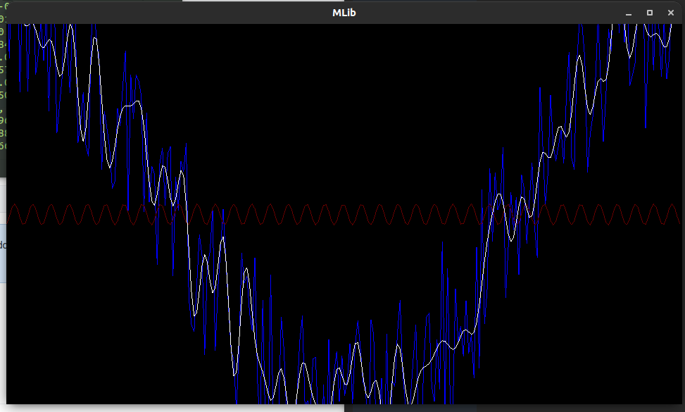

# MLib
Mathematics library

[Code documentation generated with doxygen](docs/html/) to open
documentation download file and run `index.html` using your browser.



## My library for draw lines on windows `graph`
* C++
* SDL2

## My library for work with data ranges `mlib`
* C++
* graph

# Building
## Linux

```Shell
git clone https://github.com/tarasov2000/mlib.git
cd mlib
make
./ailab
```
